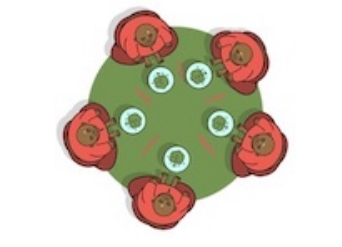

# Práctica 2: Filósofos

El problema de los filósofos, o de los filósofos que cenan (dining philosophers), es un problema clásico propuesto por E. Dijkstra en 1965 para modelar el problema de la sincronización de procesos en un sistema operativo. Los filósofos están sentados a una mesa circular, y se pasan la vida comiendo y
pensando. Para poder comer, necesitan coger los dos palillos junto a su plato.

El problema surge porque estos palillos son recursos compartidos: el palillo que queda a la derecha de un filósofo es el palillo a la izquierda de su vecino de la derecha.

  
**Figura 1:** Filósofos cenando

## Ejercicio 1: Especificación del problema de los filósofos
Especifica el problema de los filósofos como una teoría de reescritura en Maude en un fichero **dining-philosophers.maude** siguiendo las siguientes indicaciones.

- Aunque normalmente el problema se plantea para cinco filósofos, en realidad podemos definirlo para cualquier número de filósofos, siendo dicho número un parámetro de nuestra especificación. Para ello definimos la siguiente teoría NAT*:

    ``` scala
    fth NAT* is   
    protecting NAT .  
    op k : -> NzNat .  
    endfth
    ```
    En esta teoría se están protegiendo los naturales, de forma que sus posibles modelos son aquellos en los que tenemos el modelo inicial de NAT y la constante k se interpreta como cualquier valor de tipo NzNat.

- Si tenemos N filósofos, utilizaremos números entre 0 y N-1 para identificar filósofos y palillos. Y esto nos permitirá identificar los palillos que le corresponden a cada filósofo: el filósofo I podrá usar los palillos I e I+1 módulo N. Para sistematizar esta operación, definimos un módulo
parametrizado **NAT/{P :: NAT*}** con un tipo Nat/{P} de naturales módulo k con una operación [ _ ] que transforma cualquier número natural a su correspondiente número módulo k.
    ``` scala
    fmod NAT/{k :: NAT*} is       
        sort Nat/{k} .  
        op [ _ ] : Nat -> Nat/{k} .  
        var N : Nat .  
        ceq [ N ] = [ sd(N, k) ] if N >= k .  
    endfm  
    ```
- A continuación definiremos un módulo **DINING-PHILOSOPHERS{P :: NAT * }** que importa (en modo protecting) el módulo NAT/{P} en el que especificaremos el problema de los filósofos para cualquier número de filósofos.

    - Define un tipo **Status** con tres posibles valores: **thinking, hungry e eating**.
    - Crea tipos **Philosopher y Chopstick** para representar filósofos y palillos, con constructores
        ``` scala
        op philosopher : Nat/{P} Status Nat -> Philosopher .  
        op chopstick : Nat/{P} -> Chopstick . 
        ```
        Una mesa se representará como un conjunto de filósofos y palillos de tipo Configuration, con none como conjunto identidad de la unión de conjuntos definida con el operador _ _ . El
primer argumento de los operadores philosopher y chopstick representa su identificador.  
Los otros dos argumentos del operador philosopher representan su estado y el número de palillos que tiene cogidos en un momento dado (un valor entre 0 y 2).  
Cuando un palillo está libre tenemos un objeto de tipo Chopstick en el conjunto; cuando un filósofo toma un
palillo libre, este desaparece del conjunto y el número de palillos del filósofo que lo toma se
incrementa en uno. Cuando lo suelta, el palillo vuelve a aparecer en la configuración y el
contador del filósofo se decrementa.

    - Cuatro reglas especifican las acciones que pueden ocurrir en nuestro sistema:
        - get-hungry: un filósofo en estado thinking pasa a estado hungry.
        - grab-stick: un filósofo en estado hungry coge un palillo libre.
        - eat: un filósofo en estado hungry con dos palillos pasa a estado eating.
        - think: un filósofo en estado eating pasa a estado thinking y libera sus dos palillos.
    - Define un operador initState (sin argumentos) que cree una mesa con k filósofos en estado thinking y sus correspondientes palillos libres.

- Para instanciar el módulo DINING-PHILOSOPHERS necesitamos una vista desde la teoría NAT*
hasta un módulo que importe NAT en modo protecting. Esta vista debe indicar cómo instanciamos
la constante k. Para hacerlo debemos asociar a k, no un operador, sino un término, y para ello
utilizamos la sintaxis op OP to term TERM ., para interpretar k como 5 como sigue:  

    ``` scala 
    view 5 from NAT* to INT is  
        op k to term 5 .  
    endv
    ```
- Con esto ya estamos listos para crear un módulo en el que analizar el problema.
    ``` scala
    mod DINING-PHILOSOPHERS-5 is  
        pr DINING-PHILOSOPHERS{5} .  
    endm
    ```
### [ Q1 ] 
**¿Es la teoría de reescritura terminante? ¿Es coherente? ¿Es el espacio de búsqueda alcanzable a partir de initState finito? Justifica tu respuesta. Prueba a utilizar el comando reduce y el comando rewrite para reescribir el término initState usando ecuaciones, y ecuaciones y reglas, respectivamente.**

La teoría de reescritura no es terminante. Las reglas se van a estar aplicando, y consecuentemente reescribiendo, constantemente para cada filósofo, siendo de esta forma no terminante. 
Como ejemplo, un filósofo puede pasar del estado thinking a hungry con la regla get-hungry. Con la regla grab-stick estará preparado para empezar a comer. Con la regla eat pasará al estado eating. Y por último con la regla think volverá al estado thinking, volviendo al estado inicial, donde se repetiría el bucle.

Las reglas son coherentes, ya que la parte izquierda de estas están simplificadas.

El espacio de búsqueda alcanzable es finito, para comprobar esto ejecutamos 
``` scala 
Maude> search in DINING-PHILOSOPHERS-5-CHECK : initState(5) =>* c:Configuration .

Solution 4123 (state 4122)
states: 4123  rewrites: 215277 in 4859ms cpu (20772ms real) (44301 rewrites/second)
c:Configuration --> philosopher([0], hungry, 1) philosopher([1], hungry, 0) philosopher([2], hungry, 0) philosopher([
    3], hungry, 0) philosopher([4], hungry, 0)

No more solutions.
states: 4123  rewrites: 215433 in 4859ms cpu (20776ms real) (44333 rewrites/second)
```
Ejecutando esta línea vemos que se encuentra un número de soluciones finitas.

``` scala 
Maude> rewrite initState(5) .
rewrite in DINING-PHILOSOPHERS-5-CHECK : initState(5) .
rewrites: 254 in 0ms cpu (0ms real) (~ rewrites/second)
result Configuration: philosopher([0], hungry, 0) philosopher([1], hungry, 1) philosopher([2], hungry, 1) philosopher([
    3], hungry, 1) philosopher([4], hungry, 0)

Maude> red initState(5) .
reduce in DINING-PHILOSOPHERS-5-CHECK : initState(5) .
rewrites: 11 in 0ms cpu (0ms real) (~ rewrites/second)
result Configuration: chopstick([0]) chopstick([1]) chopstick([2]) chopstick([3]) chopstick([4]) philosopher([0],
    thinking, 0) philosopher([1], thinking, 0) philosopher([2], thinking, 0) philosopher([3], thinking, 0) philosopher(
    [4], thinking, 0)
```


### [ Q2 ] 
**Utiliza el comando search para buscar un estado de bloqueo. Utiliza los comandos show path y show path labels para conocer la secuencia de pasos seguida hasta dicho estado de bloqueo.**

- **Crea un módulo DINING-PHILOSOPHERS-PREDS{P :: NAT * } que importe el módulo DINING-PHILOSOPHERS{P} y defina proposiciones atómicas**

    op phil-status : Nat/{P} Status -> Prop .  
    op phil-sticks : Nat/{P} Nat -> Prop .

    **que se satisfagan si el filósofo con el identificador dado como primer argumento está en el estado indicado como segundo argumento o tiene el número de palillos indicado, respectivamente.**

- **Crea un módulo DINING-PHILOSOPHERS-5-CHECK con el que poder comprobar propiedades con el comprobador de modelos para 5 filósofos.**

Se usa el siguiente comando:
``` scala
Maude> search [1, 1000] in DINING-PHILOSOPHERS-5-CHECK : initState(5) =>! c:Configuration .

El estado de bloqueo encontrado es:

Solution 1 (state 2708)
states: 3267  rewrites: 174868 in 57ms cpu (56ms real) (3067859
	rewrites/second)
c:Configuration --> philosopher([0], hungry, 1) philosopher([1], hungry, 1)
	philosopher([2], hungry, 1) philosopher([3], hungry, 1) philosopher([4],
	hungry, 1)
```

### [ Q3 ] 
**Utiliza el comprobador de modelos de Maude para encontrar un camino hasta el estado de bloqueo. Como conocemos el estado de bloqueo (cada filósofo tiene un palillo), podemos encontrarlo verificando la propiedad temporal que niega la existencia de dicho estado: siempre es verdad que no tenemos un estado de bloqueo.**

Ejecutando el siguiente comando conseguimos el camino hasta el estado de bloqueo.
``` scala
Maude> red modelCheck(initState(5), [] ~(phil-sticks([0],1) /\ phil-sticks([1],1) /\ phil-sticks([2],1) /\ phil-sticks([3],1) /\ phil-sticks([4],1))) .

reduce in DINING-PHILOSOPHERS-5-CHECK : modelCheck(initState(5), []~ (phil-sticks([4], 1) /\ ( phil-sticks([3], 1) /\ (phil-sticks([2], 1) /\ (phil-sticks([0], 1) /\ phil-sticks([1], 1)))))) .  

rewrites: 39667 in 15ms cpu (15ms real) (2538688 rewrites/second)  
result ModelCheckResult: 
counterexample({chopstick([0]) chopstick([1]) chopstick([2]) chopstick([3]) chopstick([4]) philosopher([0], thinking, 0) philosopher([1], thinking, 0) philosopher([2], thinking, 0) philosopher([3], thinking, 0) philosopher([4], thinking, 0),'get-hungry} {chopstick([0]) chopstick([1]) chopstick([2]) chopstick([3]) chopstick([4]) philosopher([0], hungry, 0) philosopher([1], thinking, 0) philosopher([2], thinking, 0)
    philosopher([3], thinking, 0) philosopher([4], thinking, 0),'grab-stick} {chopstick([1]) chopstick([2]) chopstick([
    3]) chopstick([4]) philosopher([0], hungry, 1) philosopher([1], thinking, 0) philosopher([2], thinking, 0)
    philosopher([3], thinking, 0) philosopher([4], thinking, 0),'get-hungry} {chopstick([1]) chopstick([2]) chopstick([
    3]) chopstick([4]) philosopher([0], hungry, 1) philosopher([1], hungry, 0) philosopher([2], thinking, 0)
    philosopher([3], thinking, 0) philosopher([4], thinking, 0),'grab-stick} {chopstick([2]) chopstick([3]) chopstick([
    4]) philosopher([0], hungry, 1) philosopher([1], hungry, 1) philosopher([2], thinking, 0) philosopher([3],
    thinking, 0) philosopher([4], thinking, 0),'get-hungry} {chopstick([2]) chopstick([3]) chopstick([4]) philosopher([
    0], hungry, 1) philosopher([1], hungry, 1) philosopher([2], hungry, 0) philosopher([3], thinking, 0) philosopher([
    4], thinking, 0),'grab-stick} {chopstick([3]) chopstick([4]) philosopher([0], hungry, 1) philosopher([1], hungry,
    1) philosopher([2], hungry, 1) philosopher([3], thinking, 0) philosopher([4], thinking, 0),'get-hungry} {chopstick(
    [3]) chopstick([4]) philosopher([0], hungry, 1) philosopher([1], hungry, 1) philosopher([2], hungry, 1)
    philosopher([3], hungry, 0) philosopher([4], thinking, 0),'grab-stick} {chopstick([4]) philosopher([0], hungry, 1)
    philosopher([1], hungry, 1) philosopher([2], hungry, 1) philosopher([3], hungry, 1) philosopher([4], thinking, 0),
    'get-hungry} {chopstick([4]) philosopher([0], hungry, 1) philosopher([1], hungry, 1) philosopher([2], hungry, 1)
    philosopher([3], hungry, 1) philosopher([4], hungry, 0),'grab-stick}, {philosopher([0], hungry, 1) philosopher([1],
    hungry, 1) philosopher([2], hungry, 1) philosopher([3], hungry, 1) philosopher([4], hungry, 1),deadlock})

```
### [ Q4 ] 
**Analiza el formato del contraejemplo devuelto como resultado y proporciona la secuencia de los 10 primeros pasos con el siguiente formato: el filósofo 1 coge el palillo 1, el filósofo 1 suelta el palillo 1, el filósofo 2 coge el palillo 3, ...**

**Que el sistema pueda bloquearse no es una buena noticia, y se han propuesto varias soluciones para este problema. Especifiquemos a continuación tres de ellas.**

Filósofo 0 tiene hambre  
Filósofo 0 coge el palillo 0  
Filósofo 1 tiene hambre  
Filósofo 1 coge el palillo 1  
Filósofo 2 tiene hambre  
Filósofo 2 coge el palillo 2  
Filósofo 3 tiene hambre  
Filósofo 3 coge el palillo 3  
Filósofo 4 tiene hambre  
Filósofo 4 coge el palillo 4  

## Ejercicio 2: Jerarquía de recursos
Para evitar el problema del bloqueo, Dijstra propuso asignar un orden parcial a los palillos, estableciendo
la convención de que los palillos se cogerían en orden. Es decir, el filósofo [ I ] tomaría primero el palillo
con identificador menor entre [ I ] e [ I + 1], y después el otro. Los palillos se sueltan a la vez. Esta
sencilla solución evita la situación de bloqueo de la solución original, pues, para cinco filósofos, sólo
cuatro de los cinco podrían coger su primer palillo. Observa que para N filósofos, los filósofos 0 y N-1
intentarían primero coger el palillo 0, rompiendo así el bloqueo.

Crea una copia del fichero del Ejercicio 1 en un fichero **dining-philosophers-order.maude** y modifícalo de forma que funcione según esta variación.

### [Q5] 
**Demuestra, utilizando el comando search, que la nueva especificación no tiene bloqueos.**
Utilizando el comando search de esta manera, si no encuentra una solución significará que no encuentra ningún estado de bloqueo, por lo que, al menos desde el 1 hasta 1000, no se producen bloqueos:

``` scala
Maude> search [1, 1000] initState(5) =>! c:Configuration .
search [1, 1000] in DINING-PHILOSOPHERS-5-CHECK : initState(5) =>! c:Configuration .

No solution.
states: 972  rewrites: 101414 in 31ms cpu (42ms real) (3245248 rewrites/second)
```

### [Q6] 
**Demuestra, utilizando el comprobador de modelos, que la nueva especificación no tiene bloqueos. Esta solución no es justa: Cualquiera de los filósofos puede quedarse sin comer aunque lo desee.**

``` scala
Maude> red modelCheck(initState(5), [] ~(phil-sticks([0],1) /\
phil-sticks([1],1) /\ phil-sticks([2],1) /\ phil-sticks([3],1)
/\ phil-sticks([4],1) ) ) .
reduce in DINING-PHILOSOPHERS-5-CHECK : modelCheck(initState(5), []~ (phil-sticks([4], 1) /\ (phil-sticks([3], 1) /\ (phil-sticks([2],
    1) /\ (phil-sticks([0], 1) /\ phil-sticks([1], 1)))))) .
rewrites: 101684 in 46ms cpu (50ms real) (2169258 rewrites/second)
result Bool: true
```

Al obtener como resultado True, significa que no alcanza un estado de bloqueo
### [Q7] 
**Comprueba, utilizando el comprobador de modelos, que esta especificación no satisface la propiedad de viveza débil ni la de viveza fuerte. Es posible que los contraejemplos de la comprobación de las propiedades para los distintos filósofos tengan longitudes distintas, ¿por qué?**

#### Viveza Débil Filósofo 1
Comprobamos primero que el filósofo 1 siempre que esté en estado hungry, eventualmente pasará a estado eating. Esto se escribe de la siguiente manera

``` scala
Maude> red modelCheck(initState(5), [] ( phil-status([1],
hungry) -> <>(phil-status([1], eating))) ) .
reduce in DINING-PHILOSOPHERS-5-CHECK : modelCheck(initState(5), [](phil-status([1], hungry) -> <> phil-status([1], eating))) .
rewrites: 863 in 0ms cpu (0ms real) (~ rewrites/second)
result ModelCheckResult: counterexample({chopstick([0]) chopstick([1]) chopstick([2]) chopstick([3]) chopstick([4]) philosopher([0], thinking,
0) philosopher([1], thinking, 0) philosopher([2], thinking, 0) philosopher([3], thinking, 0) philosopher([4], thinking, 0),'get-hungry} {
chopstick([0]) chopstick([1]) chopstick([2]) chopstick([3]) chopstick([4]) philosopher([0], hungry, 0) philosopher([1], thinking, 0)
philosopher([2], thinking, 0) philosopher([3], thinking, 0) philosopher([4], thinking, 0),'grab-stick} {chopstick([0]) chopstick([2])
chopstick([3]) chopstick([4]) philosopher([0], hungry, 1) philosopher([1], thinking, 0) philosopher([2], thinking, 0) philosopher([3],
thinking, 0) philosopher([4], thinking, 0),'grab-stick} {chopstick([2]) chopstick([3]) chopstick([4]) philosopher([0], hungry, 2)
philosopher([1], thinking, 0) philosopher([2], thinking, 0) philosopher([3], thinking, 0) philosopher([4], thinking, 0),'eat} {chopstick([
2]) chopstick([3]) chopstick([4]) philosopher([0], eating, 2) philosopher([1], thinking, 0) philosopher([2], thinking, 0) philosopher([3],
thinking, 0) philosopher([4], thinking, 0),'get-hungry} {chopstick([2]) chopstick([3]) chopstick([4]) philosopher([0], eating, 2)
philosopher([1], hungry, 0) philosopher([2], thinking, 0) philosopher([3], thinking, 0) philosopher([4], thinking, 0),'grab-stick} {
chopstick([3]) chopstick([4]) philosopher([0], eating, 2) philosopher([1], hungry, 1) philosopher([2], thinking, 0) philosopher([3],
thinking, 0) philosopher([4], thinking, 0),'think} {chopstick([0]) chopstick([1]) chopstick([3]) chopstick([4]) philosopher([0], thinking,
0) philosopher([1], hungry, 1) philosopher([2], thinking, 0) philosopher([3], thinking, 0) philosopher([4], thinking, 0),'grab-stick} 

Bucle infinito:
{chopstick([0]) chopstick([3]) chopstick([4]) philosopher([0], thinking, 0) philosopher([1], hungry, 2) philosopher([2], thinking, 0)
philosopher([3], thinking, 0) philosopher([4], thinking, 0),'get-hungry} {chopstick([0]) chopstick([3]) chopstick([4]) philosopher([0],
hungry, 0) philosopher([1], hungry, 2) philosopher([2], thinking, 0) philosopher([3], thinking, 0) philosopher([4], thinking, 0),
'get-hungry} {chopstick([0]) chopstick([3]) chopstick([4]) philosopher([0], hungry, 0) philosopher([1], hungry, 2) philosopher([2],
hungry, 0) philosopher([3], thinking, 0) philosopher([4], thinking, 0),'grab-stick} {chopstick([0]) chopstick([4]) philosopher([0],
hungry, 0) philosopher([1], hungry, 2) philosopher([2], hungry, 1) philosopher([3], thinking, 0) philosopher([4], thinking, 0),
'get-hungry}, {chopstick([0]) chopstick([4]) philosopher([0], hungry, 0) philosopher([1], hungry, 2) philosopher([2], hungry, 1)
philosopher([3], hungry, 0) philosopher([4], thinking, 0),'get-hungry} {chopstick([0]) chopstick([4]) philosopher([0], hungry, 0)
philosopher([1], hungry, 2) philosopher([2], hungry, 1) philosopher([3], hungry, 0) philosopher([4], hungry, 0),'grab-stick} {chopstick([
0]) philosopher([0], hungry, 0) philosopher([1], hungry, 2) philosopher([2], hungry, 1) philosopher([3], hungry, 0) philosopher([4],
hungry, 1),'grab-stick} {philosopher([0], hungry, 0) philosopher([1], hungry, 2) philosopher([2], hungry, 1) philosopher([3], hungry, 0)
philosopher([4], hungry, 2),'eat} {philosopher([0], hungry, 0) philosopher([1], hungry, 2) philosopher([2], hungry, 1) philosopher([3],
hungry, 0) philosopher([4], eating, 2),'think})
```
Como podemos observar, Maude ha encontrado un contraejemplo, por lo tanto la propiedad de viveza débil no se cumple.

#### Viveza Fuerte Filósofo 1

Comprobamos si el filósofo 1 está en estado hungry infinitamente a menudo, entonces pasará a estado eating infinitamente a menudo.

```scala
Maude> red modelCheck(initState(5), ([] <> phil-status([1],
hungry)) -> ([] <> phil-status([1], eating))) .
reduce in DINING-PHILOSOPHERS-5-CHECK : modelCheck(initState(5), []<> phil-status([1], hungry) -> []<> phil-status([1], eating)) .
rewrites: 922 in 0ms cpu (0ms real) (~ rewrites/second)
result ModelCheckResult: counterexample({chopstick([0]) chopstick([1]) chopstick([2]) chopstick([3]) chopstick([4]) philosopher([0], thinking,
    0) philosopher([1], thinking, 0) philosopher([2], thinking, 0) philosopher([3], thinking, 0) philosopher([4], thinking, 0),'get-hungry} {
    chopstick([0]) chopstick([1]) chopstick([2]) chopstick([3]) chopstick([4]) philosopher([0], hungry, 0) philosopher([1], thinking, 0)
    philosopher([2], thinking, 0) philosopher([3], thinking, 0) philosopher([4], thinking, 0),'grab-stick} {chopstick([0]) chopstick([2])
    chopstick([3]) chopstick([4]) philosopher([0], hungry, 1) philosopher([1], thinking, 0) philosopher([2], thinking, 0) philosopher([3],
    thinking, 0) philosopher([4], thinking, 0),'grab-stick} {chopstick([2]) chopstick([3]) chopstick([4]) philosopher([0], hungry, 2)
    philosopher([1], thinking, 0) philosopher([2], thinking, 0) philosopher([3], thinking, 0) philosopher([4], thinking, 0),'eat} {chopstick([
    2]) chopstick([3]) chopstick([4]) philosopher([0], eating, 2) philosopher([1], thinking, 0) philosopher([2], thinking, 0) philosopher([3],
    thinking, 0) philosopher([4], thinking, 0),'get-hungry} {chopstick([2]) chopstick([3]) chopstick([4]) philosopher([0], eating, 2)
    philosopher([1], hungry, 0) philosopher([2], thinking, 0) philosopher([3], thinking, 0) philosopher([4], thinking, 0),'grab-stick} {
    chopstick([3]) chopstick([4]) philosopher([0], eating, 2) philosopher([1], hungry, 1) philosopher([2], thinking, 0) philosopher([3],
    thinking, 0) philosopher([4], thinking, 0),'think} {chopstick([0]) chopstick([1]) chopstick([3]) chopstick([4]) philosopher([0], thinking,
    0) philosopher([1], hungry, 1) philosopher([2], thinking, 0) philosopher([3], thinking, 0) philosopher([4], thinking, 0),'grab-stick} 
    
    Bucle Infinito:
    {chopstick([0]) chopstick([3]) chopstick([4]) philosopher([0], thinking, 0) philosopher([1], hungry, 2) philosopher([2], thinking, 0)
    philosopher([3], thinking, 0) philosopher([4], thinking, 0),'get-hungry} {chopstick([0]) chopstick([3]) chopstick([4]) philosopher([0],
    hungry, 0) philosopher([1], hungry, 2) philosopher([2], thinking, 0) philosopher([3], thinking, 0) philosopher([4], thinking, 0),
    'get-hungry} {chopstick([0]) chopstick([3]) chopstick([4]) philosopher([0], hungry, 0) philosopher([1], hungry, 2) philosopher([2],
    hungry, 0) philosopher([3], thinking, 0) philosopher([4], thinking, 0),'grab-stick} {chopstick([0]) chopstick([4]) philosopher([0],
    hungry, 0) philosopher([1], hungry, 2) philosopher([2], hungry, 1) philosopher([3], thinking, 0) philosopher([4], thinking, 0),
    'get-hungry}, {chopstick([0]) chopstick([4]) philosopher([0], hungry, 0) philosopher([1], hungry, 2) philosopher([2], hungry, 1)
    philosopher([3], hungry, 0) philosopher([4], thinking, 0),'get-hungry} {chopstick([0]) chopstick([4]) philosopher([0], hungry, 0)
    philosopher([1], hungry, 2) philosopher([2], hungry, 1) philosopher([3], hungry, 0) philosopher([4], hungry, 0),'grab-stick} {chopstick([
    0]) philosopher([0], hungry, 0) philosopher([1], hungry, 2) philosopher([2], hungry, 1) philosopher([3], hungry, 0) philosopher([4],
    hungry, 1),'grab-stick} {philosopher([0], hungry, 0) philosopher([1], hungry, 2) philosopher([2], hungry, 1) philosopher([3], hungry, 0)
    philosopher([4], hungry, 2),'eat} {philosopher([0], hungry, 0) philosopher([1], hungry, 2) philosopher([2], hungry, 1) philosopher([3],
    hungry, 0) philosopher([4], eating, 2),'think})
```
Como Maude ha encontrado un contraejemplo de la viveza fuerte, podemos observar que no se cumple la propiedad de viveza fuerte para esta especificación.

Ahora vamos a comprobar la viveza débil y fuerte del filósofo 3, para así ver la diferencia de longitud entre los contraejemplos de los dos filósofos.

#### Viveza débil filósofo 3

```scala
Maude> red modelCheck(initState(5), [] ( phil-status([3],
hungry) -> <>(phil-status([3], eating))) ) .
reduce in DINING-PHILOSOPHERS-5-CHECK : modelCheck(initState(5), [](phil-status([3], hungry) -> <> phil-status([3], eating))) .
rewrites: 4538 in 0ms cpu (2ms real) (~ rewrites/second)
result ModelCheckResult: counterexample({chopstick([0]) chopstick([1]) chopstick([2]) chopstick([3]) chopstick([4]) philosopher([0], thinking,
    0) philosopher([1], thinking, 0) philosopher([2], thinking, 0) philosopher([3], thinking, 0) philosopher([4], thinking, 0),'get-hungry} {
    chopstick([0]) chopstick([1]) chopstick([2]) chopstick([3]) chopstick([4]) philosopher([0], hungry, 0) philosopher([1], thinking, 0)
    philosopher([2], thinking, 0) philosopher([3], thinking, 0) philosopher([4], thinking, 0),'grab-stick} {chopstick([0]) chopstick([2])
    chopstick([3]) chopstick([4]) philosopher([0], hungry, 1) philosopher([1], thinking, 0) philosopher([2], thinking, 0) philosopher([3],
    thinking, 0) philosopher([4], thinking, 0),'grab-stick} {chopstick([2]) chopstick([3]) chopstick([4]) philosopher([0], hungry, 2)
    philosopher([1], thinking, 0) philosopher([2], thinking, 0) philosopher([3], thinking, 0) philosopher([4], thinking, 0),'eat} {chopstick([
    2]) chopstick([3]) chopstick([4]) philosopher([0], eating, 2) philosopher([1], thinking, 0) philosopher([2], thinking, 0) philosopher([3],
    thinking, 0) philosopher([4], thinking, 0),'get-hungry} {chopstick([2]) chopstick([3]) chopstick([4]) philosopher([0], eating, 2)
    philosopher([1], hungry, 0) philosopher([2], thinking, 0) philosopher([3], thinking, 0) philosopher([4], thinking, 0),'grab-stick} {
    chopstick([3]) chopstick([4]) philosopher([0], eating, 2) philosopher([1], hungry, 1) philosopher([2], thinking, 0) philosopher([3],
    thinking, 0) philosopher([4], thinking, 0),'think} {chopstick([0]) chopstick([1]) chopstick([3]) chopstick([4]) philosopher([0], thinking,
    0) philosopher([1], hungry, 1) philosopher([2], thinking, 0) philosopher([3], thinking, 0) philosopher([4], thinking, 0),'grab-stick} {
    chopstick([0]) chopstick([3]) chopstick([4]) philosopher([0], thinking, 0) philosopher([1], hungry, 2) philosopher([2], thinking, 0)
    philosopher([3], thinking, 0) philosopher([4], thinking, 0),'get-hungry} {chopstick([0]) chopstick([3]) chopstick([4]) philosopher([0],
    hungry, 0) philosopher([1], hungry, 2) philosopher([2], thinking, 0) philosopher([3], thinking, 0) philosopher([4], thinking, 0),'eat} {
    chopstick([0]) chopstick([3]) chopstick([4]) philosopher([0], hungry, 0) philosopher([1], eating, 2) philosopher([2], thinking, 0)
    philosopher([3], thinking, 0) philosopher([4], thinking, 0),'get-hungry} {chopstick([0]) chopstick([3]) chopstick([4]) philosopher([0],
    hungry, 0) philosopher([1], eating, 2) philosopher([2], hungry, 0) philosopher([3], thinking, 0) philosopher([4], thinking, 0),
    'grab-stick} {chopstick([0]) chopstick([4]) philosopher([0], hungry, 0) philosopher([1], eating, 2) philosopher([2], hungry, 1)
    philosopher([3], thinking, 0) philosopher([4], thinking, 0),'think}

    ...
    
    Bucle Infinito: 
    {chopstick([0]) philosopher([0], hungry, 0) philosopher([1],
    hungry, 2) philosopher([2], thinking, 0) philosopher([3], hungry, 2) philosopher([4], thinking, 0),'eat} {chopstick([0]) philosopher([0],
    hungry, 0) philosopher([1], eating, 2) philosopher([2], thinking, 0) philosopher([3], hungry, 2) philosopher([4], thinking, 0),'think} {
    chopstick([0]) chopstick([1]) chopstick([2]) philosopher([0], hungry, 0) philosopher([1], thinking, 0) philosopher([2], thinking, 0)
    philosopher([3], hungry, 2) philosopher([4], thinking, 0),'grab-stick} {chopstick([0]) chopstick([2]) philosopher([0], hungry, 1)
    philosopher([1], thinking, 0) philosopher([2], thinking, 0) philosopher([3], hungry, 2) philosopher([4], thinking, 0),'grab-stick} {
    chopstick([2]) philosopher([0], hungry, 2) philosopher([1], thinking, 0) philosopher([2], thinking, 0) philosopher([3], hungry, 2)
    philosopher([4], thinking, 0),'eat} {chopstick([2]) philosopher([0], eating, 2) philosopher([1], thinking, 0) philosopher([2], thinking,
    0) philosopher([3], hungry, 2) philosopher([4], thinking, 0),'think} {chopstick([0]) chopstick([1]) chopstick([2]) philosopher([0],
    thinking, 0) philosopher([1], thinking, 0) philosopher([2], thinking, 0) philosopher([3], hungry, 2) philosopher([4], thinking, 0),
    'get-hungry} {chopstick([0]) chopstick([1]) chopstick([2]) philosopher([0], thinking, 0) philosopher([1], hungry, 0) philosopher([2],
    thinking, 0) philosopher([3], hungry, 2) philosopher([4], thinking, 0),'grab-stick} {chopstick([0]) chopstick([1]) philosopher([0],
    thinking, 0) philosopher([1], hungry, 1) philosopher([2], thinking, 0) philosopher([3], hungry, 2) philosopher([4], thinking, 0),
    'get-hungry}

    ...
```
Como ocurre con el filósofo 1, se genera también un contraejemplo, pero esta vez su longitud es muchísimo mayor a la vista para el contraejemplo de viveza débil del filósofo 1.

Esta vez, hemos recortado la longitud del camino y la del bucle más de la mitad cada una debido a que ocupaban una parte demasiado grande del documento.

Esto ocurre debido a que, utilizando modelCheck, Maude intenta buscar distintas soluciones arbitrarias explorando varios caminos, por lo que el camino hasta el bucle infinito y el bucle infinito en sí son más largos que con el filósofo 1, por lo tanto se realizan muchísimas más reescrituras.

#### Viveza fuerte filósofo 3

```scala
Maude> red modelCheck(initState(5), ([] <> phil-status([3],
hungry)) -> ([] <> phil-status([3], eating))) .
reduce in DINING-PHILOSOPHERS-5-CHECK : modelCheck(initState(5), []<> phil-status([3], hungry) -> []<> phil-status([3], eating)) .
rewrites: 4651 in 0ms cpu (2ms real) (~ rewrites/second)
result ModelCheckResult: counterexample({chopstick([0]) chopstick([1]) chopstick([2]) chopstick([3]) chopstick([4]) philosopher([0], thinking, 0) philosopher([1], thinking, 0) philosopher([2], thinking, 0) philosopher(
    [3], thinking, 0) philosopher([4], thinking, 0),'get-hungry} {chopstick([0]) chopstick([1]) chopstick([2]) chopstick([3]) chopstick([4]) philosopher([0], hungry, 0) philosopher([1], thinking, 0) philosopher([2],
    thinking, 0) philosopher([3], thinking, 0) philosopher([4], thinking, 0),'grab-stick} {chopstick([0]) chopstick([2]) chopstick([3]) chopstick([4]) philosopher([0], hungry, 1) philosopher([1], thinking, 0)
    philosopher([2], thinking, 0) philosopher([3], thinking, 0) philosopher([4], thinking, 0),'grab-stick} {chopstick([2]) chopstick([3]) chopstick([4]) philosopher([0], hungry, 2) philosopher([1], thinking, 0)
    philosopher([2], thinking, 0) philosopher([3], thinking, 0) philosopher([4], thinking, 0),'eat} {chopstick([2]) chopstick([3]) chopstick([4]) philosopher([0], eating, 2) philosopher([1], thinking, 0) philosopher([
    2], thinking, 0) philosopher([3], thinking, 0) philosopher([4], thinking, 0),'get-hungry} {chopstick([2]) chopstick([3]) chopstick([4]) philosopher([0], eating, 2) philosopher([1], hungry, 0) philosopher([2],
    thinking, 0) philosopher([3], thinking, 0) philosopher([4], thinking, 0),'grab-stick} {chopstick([3]) chopstick([4]) philosopher([0], eating, 2) philosopher([1], hungry, 1) philosopher([2], thinking, 0)
    philosopher([3], thinking, 0) philosopher([4], thinking, 0),'think} {chopstick([0]) chopstick([1]) chopstick([3]) chopstick([4]) philosopher([0], thinking, 0) philosopher([1], hungry, 1) philosopher([2], thinking,
    0) philosopher([3], thinking, 0) philosopher([4], thinking, 0),'grab-stick} {chopstick([0]) chopstick([3]) chopstick([4]) philosopher([0], thinking, 0) philosopher([1], hungry, 2) philosopher([2], thinking, 0)
    philosopher([3], thinking, 0) philosopher([4], thinking, 0),'get-hungry} {chopstick([0]) chopstick([3]) chopstick([4]) philosopher([0], hungry, 0) philosopher([1], hungry, 2) philosopher([2], thinking, 0)
    philosopher([3], thinking, 0) philosopher([4], thinking, 0),'eat} {chopstick([0]) chopstick([3]) chopstick([4]) philosopher([0], hungry, 0) philosopher([1], eating, 2) philosopher([2], thinking, 0) philosopher([3],
    thinking, 0) philosopher([4], thinking, 0),'get-hungry}

    ...
    
    Bucle infinito: 
    {chopstick([0]) philosopher([0], thinking, 0) philosopher([1], hungry, 2) philosopher([2], thinking, 0) philosopher([3], hungry, 2) philosopher([4], thinking, 0),'get-hungry} {chopstick([0]) philosopher([0], hungry, 0)        
    philosopher([1], hungry, 2) philosopher([2], thinking, 0) philosopher([3], hungry, 2) philosopher([4], thinking, 0),'eat} {chopstick([0]) philosopher([0], hungry, 0) philosopher([1], eating, 2) philosopher([2],     
    thinking, 0) philosopher([3], hungry, 2) philosopher([4], thinking, 0),'think} {chopstick([0]) chopstick([1]) chopstick([2]) philosopher([0], hungry, 0) philosopher([1], thinking, 0) philosopher([2], thinking, 0)   
    philosopher([3], hungry, 2) philosopher([4], thinking, 0),'grab-stick} {chopstick([0]) chopstick([2]) philosopher([0], hungry, 1) philosopher([1], thinking, 0) philosopher([2], thinking, 0) philosopher([3], hungry,
    2) philosopher([4], thinking, 0),'grab-stick} {chopstick([2]) philosopher([0], hungry, 2) philosopher([1], thinking, 0) philosopher([2], thinking, 0) philosopher([3], hungry, 2) philosopher([4], thinking, 0),'eat}  
    {chopstick([2]) philosopher([0], eating, 2) philosopher([1], thinking, 0) philosopher([2], thinking, 0) philosopher([3], hungry, 2) philosopher([4], thinking, 0),'think} {chopstick([0]) chopstick([1]) chopstick([   
    2]) philosopher([0], thinking, 0) philosopher([1], thinking, 0) philosopher([2], thinking, 0) philosopher([3], hungry, 2) philosopher([4], thinking, 0),'get-hungry} {chopstick([0]) chopstick([1]) chopstick([2])
    philosopher([0], thinking, 0) philosopher([1], hungry, 0) philosopher([2], thinking, 0) philosopher([3], hungry, 2) philosopher([4], thinking, 0),'grab-stick} 

    ...
```
Como ocurría con el filósofo 1, se nos ha generado un contraejemplo que demuestra que no se cumple la propiedad de viveza fuerte en esta especificación.

Hemos vuelto a recortar el contraejemplo debido a la extensa longitud, dejando lo justo y necesario para ver cómo su longitud varía mucho con la del contraejemplo de viveza fuerte del filósofo 1.

## Ejercicio 3: Un gestor de procesos
Otra solución consiste en limitar el número de comensales sentados a la mesa. Si tenemos una mesa para N filósofos, la solución consistiría en dejar que sólo haya N-1 filósofos como máximo sentados a la mesa en cada momento, de forma que cualquiera de ellos puede comer sin temor a bloqueos. Para ello, contamos con un portero que controla el acceso. Mientras un filósofo está pensando, este está fuera de la mesa (no está en la configuración que representa la mesa). El portero se encarga de controlar el número de filósofos a N-1, es decir, un filósofo sólo puede sentarse a la mesa si no se ha superado el límite de comensales en ella, y abandona la mesa cuando deja de comer. Para garantizar que ningún filósofo se queda sin sentarse en la mesa si lo desea, tenemos que garantizar que el portero deja entrar
a los filósofos de forma justa. Podemos garantizarlo implementando una cola para los filósofos que desean pasar a la mesa, de forma que cuando un filósofo pasa a estar hambriento se pone en una cola, que eventualmente le dará acceso a la mesa.

Para ello, se definirá un tipo **System** con constructor
``` scala
op [ _ ,_ ,_ ] : Configuration Queue Configuration -> System .
```
que representa la mesa (primer argumento), la cola de filósofos hambrientos en espera de pasar a la mesa (segundo argumento) y el conjunto de filósofos fuera de la mesa. Inicialmente, los palillos estarán en la mesa (primer argumento), sólo filósofos en la mesa podrán acceder a ellos, y estos serán devueltos a la mesa cuando terminan de ser usados antes de abandonar la mesa. La cola la implementaremos
como una lista de valores de tipo Nat/{P}, en la que los elementos se añaden por un extremo y se sacan por el otro. Los filósofos en espera se mantendrán en la configuración del tercer argumento mientras se
les da paso.

Crea una copia del fichero del Ejercicio 1 en un fichero dining-philosophers-rooms.maude y modifícalo de forma que funcione según esta variación con las siguientes reglas:

- `get-hungry`: un filósofo en estado `thinking` pasa a estado `hungry` y se pone en la cola para pasar a la mesa
- `enter`: el primer filósofo en la cola pasa a la mesa si el número de filósofos en ella es menor que *N-1*.
- `grab-stick`: un filósofo en estado `hungry` coge un palillo libre.
- `eat`: un filósofo con en estado `hungry` con dos palillos pasa a estado `eating`.
- `think`: un filósofo en estado `eating` pasa a estado `thinking`, libera sus dos palillos y abandona la mesa.

### [ Q8 ] 
Demuestra, utilizando el comando search, que esta especificación no tiene bloqueos.
Para poder utilizar el comprobador de modelos necesitamos adaptar las definiciones de las proposiciones
atómicas en el módulo DINING-PHILOSOPHERS-PREDS al nuevo tipo de estado.

Ejecutando el comando: 
```scala
Maude> search [1,1000] initState(5) =>! s:System .
search [1, 1000] in DINING-PHILOSOPHERS-5-CHECK : initState(5) =>! s:System .
No solution.
states: 22137  rewrites: 1513234 in 551ms cpu (551ms real) (2746341
	rewrites/second)

```
No encuentra estados de bloqueo


### [ Q9 ] 
Demuestra, utilizando el comprobador de modelos, que esta especificación no tiene bloqueos.
Esta solución, sin embargo, no es justa. Cualquiera de los filósofos puede quedarse sin comer aunque lo
desee.

Ejecutando el comando: 
```scala 
Maude> red modelCheck(initState(5), [] ~(phil-sticks([0],1) /\ phil-sticks([1],1) /\ phil-sticks([2],1) /\ phil-sticks([3],1) /\ phil-sticks([4],1) ) ) .
reduce in DINING-PHILOSOPHERS-5-CHECK : modelCheck(initState(5), []~ (
	phil-sticks([4], 1) /\ (phil-sticks([3], 1) /\ (phil-sticks([2], 1) /\ (
	phil-sticks([0], 1) /\ phil-sticks([1], 1)))))) .
rewrites: 1518333 in 1207ms cpu (1209ms real) (1257939 rewrites/second)
result Bool: true

```

Se evalúa el estado de bloqueo para comprobar si se cumple.
Si se cumple usando [], se cumple siempre. Y si se cumple siempre, significa que no hay ningún estado en el que todos los filósofos tengan un palillo.

Siendo el resultado True, no hay contraejemplos que lleguen a estado de bloqueo, así que no hay.
### [ Q10 ] 
Comprueba, utilizando el comprobador de modelos, que esta especificación no satisface la
propiedad de viveza débil ni la de viveza fuerte.


Para comprobar viveza débil comprobaremos si un proceso que está a la espera de entrar en su sección crítica lo hará.

Se usará el comando modelCheck.
Se comprobará si siempre que el filósofo esté en el estado hungry, acabará llegando al estado eating en algún momento.

Se usará el comando:
```scala
Maude> red modelCheck(initState(5), [] ( phil-status([0], hungry) -> <>(phil-status([0], eating))) ) .

reduce in DINING-PHILOSOPHERS-5-CHECK : modelCheck(initState(5), [](phil-status([0], hungry) -> <>
   phil-status([0], eating))) .
rewrites: 4019 in 0ms cpu (1ms real) (4031093 rewrites/second)
result ModelCheckResult: counterexample({[chopstick([0]) chopstick([1]) chopstick([2]) chopstick([3])
   chopstick([4]),nilQueue,philosopher([0], thinking, 0) philosopher([1], thinking, 0) philosopher([2],
   thinking, 0) philosopher([3], thinking, 0) philosopher([4], thinking, 0)],'get-hungry} {[chopstick([
   0]) chopstick([1]) chopstick([2]) chopstick([3]) chopstick([4]),nilQueue,philosopher([0], hungry, 0)
   philosopher([1], thinking, 0) philosopher([2], thinking, 0) philosopher([3], thinking, 0) philosopher(
   [4], thinking, 0)],'get-hungry} {[chopstick([0]) chopstick([1]) chopstick([2]) chopstick([3])
   chopstick([4]),nilQueue,philosopher([0], hungry, 0) philosopher([1], hungry, 0) philosopher([2],
   thinking, 0) philosopher([3], thinking, 0) philosopher([4], thinking, 0)],'get-hungry} {[chopstick([
   0]) chopstick([1]) chopstick([2]) chopstick([3]) chopstick([4]),nilQueue,philosopher([0], hungry, 0)
   philosopher([1], hungry, 0) philosopher([2], hungry, 0) philosopher([3], thinking, 0) philosopher([4],
   thinking, 0)],'get-hungry} {[chopstick([0]) chopstick([1]) chopstick([2]) chopstick([3]) chopstick([
   4]),nilQueue,philosopher([0], hungry, 0) philosopher([1], hungry, 0) philosopher([2], hungry, 0)
   philosopher([3], hungry, 0) philosopher([4], thinking, 0)],'get-hungry} {[chopstick([0]) chopstick([
   1]) chopstick([2]) chopstick([3]) chopstick([4]),nilQueue,philosopher([0], hungry, 0) philosopher([1],
   hungry, 0) philosopher([2], hungry, 0) philosopher([3], hungry, 0) philosopher([4], hungry, 0)],
   'in-queue} {[chopstick([0]) chopstick([1]) chopstick([2]) chopstick([3]) chopstick([4]),[0],
   philosopher([1], hungry, 0) philosopher([2], hungry, 0) philosopher([3], hungry, 0) philosopher([4],
   hungry, 0)],'in-queue} {[chopstick([0]) chopstick([1]) chopstick([2]) chopstick([3]) chopstick([4]),[
   1] [0],philosopher([2], hungry, 0) philosopher([3], hungry, 0) philosopher([4], hungry, 0)],'in-queue}
   {[chopstick([0]) chopstick([1]) chopstick([2]) chopstick([3]) chopstick([4]),[2] [1] [0],philosopher([
   3], hungry, 0) philosopher([4], hungry, 0)],'in-queue} {[chopstick([0]) chopstick([1]) chopstick([2])
   chopstick([3]) chopstick([4]),[3] [2] [1] [0],philosopher([4], hungry, 0)],'in-queue} {[chopstick([0])
   chopstick([1]) chopstick([2]) chopstick([3]) chopstick([4]),[4] [3] [2] [1] [0],none],'enter} {[
   chopstick([0]) chopstick([1]) chopstick([2]) chopstick([3]) chopstick([4]) philosopher([0], hungry,
   0),[4] [3] [2] [1],none],'enter} {[chopstick([0]) chopstick([1]) chopstick([2]) chopstick([3])
   chopstick([4]) philosopher([0], hungry, 0) philosopher([1], hungry, 0),[4] [3] [2],none],'enter} {[
   chopstick([0]) chopstick([1]) chopstick([2]) chopstick([3]) chopstick([4]) philosopher([0], hungry, 0)
   philosopher([1], hungry, 0) philosopher([2], hungry, 0),[4] [3],none],'enter} {[chopstick([0])
   chopstick([1]) chopstick([2]) chopstick([3]) chopstick([4]) philosopher([0], hungry, 0) philosopher([
   1], hungry, 0) philosopher([2], hungry, 0) philosopher([3], hungry, 0),[4],none],'grab-stick} {[
   chopstick([1]) chopstick([2]) chopstick([3]) chopstick([4]) philosopher([0], hungry, 1) philosopher([
   1], hungry, 0) philosopher([2], hungry, 0) philosopher([3], hungry, 0),[4],none],'grab-stick} {[
   chopstick([2]) chopstick([3]) chopstick([4]) philosopher([0], hungry, 2) philosopher([1], hungry, 0)
   philosopher([2], hungry, 0) philosopher([3], hungry, 0),[4],none],'grab-stick} {[chopstick([3])
   chopstick([4]) philosopher([0], hungry, 2) philosopher([1], hungry, 0) philosopher([2], hungry, 1)
   philosopher([3], hungry, 0),[4],none],'grab-stick} {[chopstick([4]) philosopher([0], hungry, 2)
   philosopher([1], hungry, 0) philosopher([2], hungry, 2) philosopher([3], hungry, 0),[4],none],
   'grab-stick} {[philosopher([0], hungry, 2) philosopher([1], hungry, 0) philosopher([2], hungry, 2)
   philosopher([3], hungry, 1),[4],none],'eat} {[philosopher([0], hungry, 2) philosopher([1], hungry, 0)
   philosopher([2], eating, 2) philosopher([3], hungry, 1),[4],none],'think} {[chopstick([2]) chopstick([
   3]) philosopher([0], hungry, 2) philosopher([1], hungry, 0) philosopher([3], hungry, 1),[4],
   philosopher([2], thinking, 0)],'get-hungry} {[chopstick([2]) chopstick([3]) philosopher([0], hungry,
   2) philosopher([1], hungry, 0) philosopher([3], hungry, 1),[4],philosopher([2], hungry, 0)],'in-queue}
   {[chopstick([2]) chopstick([3]) philosopher([0], hungry, 2) philosopher([1], hungry, 0) philosopher([
   3], hungry, 1),[2] [4],none],'enter} {[chopstick([2]) chopstick([3]) philosopher([0], hungry, 2)
   philosopher([1], hungry, 0) philosopher([3], hungry, 1) philosopher([4], hungry, 0),[2],none],
   'grab-stick}, {[chopstick([2]) philosopher([0], hungry, 2) philosopher([1], hungry, 0) philosopher([
   3], hungry, 2) philosopher([4], hungry, 0),[2],none],'eat} {[chopstick([2]) philosopher([0], hungry,
   2) philosopher([1], hungry, 0) philosopher([3], eating, 2) philosopher([4], hungry, 0),[2],none],
   'think} {[chopstick([2]) chopstick([3]) chopstick([4]) philosopher([0], hungry, 2) philosopher([1],
   hungry, 0) philosopher([4], hungry, 0),[2],philosopher([3], thinking, 0)],'get-hungry} {[chopstick([
   2]) chopstick([3]) chopstick([4]) philosopher([0], hungry, 2) philosopher([1], hungry, 0) philosopher(
   [4], hungry, 0),[2],philosopher([3], hungry, 0)],'in-queue} {[chopstick([2]) chopstick([3]) chopstick(
   [4]) philosopher([0], hungry, 2) philosopher([1], hungry, 0) philosopher([4], hungry, 0),[3] [2],
   none],'enter} {[chopstick([2]) chopstick([3]) chopstick([4]) philosopher([0], hungry, 2) philosopher([
   1], hungry, 0) philosopher([2], hungry, 0) philosopher([4], hungry, 0),[3],none],'grab-stick} {[
   chopstick([3]) chopstick([4]) philosopher([0], hungry, 2) philosopher([1], hungry, 0) philosopher([2],
   hungry, 1) philosopher([4], hungry, 0),[3],none],'grab-stick} {[chopstick([4]) philosopher([0],
   hungry, 2) philosopher([1], hungry, 0) philosopher([2], hungry, 2) philosopher([4], hungry, 0),[3],
   none],'eat} {[chopstick([4]) philosopher([0], hungry, 2) philosopher([1], hungry, 0) philosopher([2],
   eating, 2) philosopher([4], hungry, 0),[3],none],'think} {[chopstick([2]) chopstick([3]) chopstick([
   4]) philosopher([0], hungry, 2) philosopher([1], hungry, 0) philosopher([4], hungry, 0),[3],
   philosopher([2], thinking, 0)],'get-hungry} {[chopstick([2]) chopstick([3]) chopstick([4])
   philosopher([0], hungry, 2) philosopher([1], hungry, 0) philosopher([4], hungry, 0),[3],philosopher([
   2], hungry, 0)],'in-queue} {[chopstick([2]) chopstick([3]) chopstick([4]) philosopher([0], hungry, 2)
   philosopher([1], hungry, 0) philosopher([4], hungry, 0),[2] [3],none],'enter} {[chopstick([2])
   chopstick([3]) chopstick([4]) philosopher([0], hungry, 2) philosopher([1], hungry, 0) philosopher([3],
   hungry, 0) philosopher([4], hungry, 0),[2],none],'grab-stick} {[chopstick([2]) chopstick([4])
   philosopher([0], hungry, 2) philosopher([1], hungry, 0) philosopher([3], hungry, 1) philosopher([4],
   hungry, 0),[2],none],'grab-stick})
```
Se encuentra un contraejemplo, así que la propiedad de viveza débil no se cumple.

Para comprobar viveza fuerte comprobaremos si cuando un proceso espera infinitamente a menudo, entonces entra en su sección crítica infinitamente a menudo.

Se usará el comando modelCheck.
Se comprobará que si un filósofo está en estado hungry infinitamente a menudo, entonces pasará al estado eating infinitamente a menudo.

Se usará el comando:
```scala
Maude> red modelCheck(initState(5), [] ( phil-status([0], hungry) -> <>(phil-status([0], eating))) ) .
  
reduce in DINING-PHILOSOPHERS-5-CHECK : modelCheck(initState(5), []<> phil-status([0], hungry) -> []<>
   phil-status([0], eating)) .
rewrites: 4153 in 1ms cpu (1ms real) (2091137 rewrites/second)
result ModelCheckResult: counterexample({[chopstick([0]) chopstick([1]) chopstick([2]) chopstick([3])
   chopstick([4]),nilQueue,philosopher([0], thinking, 0) philosopher([1], thinking, 0) philosopher([2],
   thinking, 0) philosopher([3], thinking, 0) philosopher([4], thinking, 0)],'get-hungry} {[chopstick([
   0]) chopstick([1]) chopstick([2]) chopstick([3]) chopstick([4]),nilQueue,philosopher([0], hungry, 0)
   philosopher([1], thinking, 0) philosopher([2], thinking, 0) philosopher([3], thinking, 0) philosopher(
   [4], thinking, 0)],'get-hungry} {[chopstick([0]) chopstick([1]) chopstick([2]) chopstick([3])
   chopstick([4]),nilQueue,philosopher([0], hungry, 0) philosopher([1], hungry, 0) philosopher([2],
   thinking, 0) philosopher([3], thinking, 0) philosopher([4], thinking, 0)],'get-hungry} {[chopstick([
   0]) chopstick([1]) chopstick([2]) chopstick([3]) chopstick([4]),nilQueue,philosopher([0], hungry, 0)
   philosopher([1], hungry, 0) philosopher([2], hungry, 0) philosopher([3], thinking, 0) philosopher([4],
   thinking, 0)],'get-hungry} {[chopstick([0]) chopstick([1]) chopstick([2]) chopstick([3]) chopstick([
   4]),nilQueue,philosopher([0], hungry, 0) philosopher([1], hungry, 0) philosopher([2], hungry, 0)
   philosopher([3], hungry, 0) philosopher([4], thinking, 0)],'get-hungry} {[chopstick([0]) chopstick([
   1]) chopstick([2]) chopstick([3]) chopstick([4]),nilQueue,philosopher([0], hungry, 0) philosopher([1],
   hungry, 0) philosopher([2], hungry, 0) philosopher([3], hungry, 0) philosopher([4], hungry, 0)],
   'in-queue} {[chopstick([0]) chopstick([1]) chopstick([2]) chopstick([3]) chopstick([4]),[0],
   philosopher([1], hungry, 0) philosopher([2], hungry, 0) philosopher([3], hungry, 0) philosopher([4],
   hungry, 0)],'in-queue} {[chopstick([0]) chopstick([1]) chopstick([2]) chopstick([3]) chopstick([4]),[
   1] [0],philosopher([2], hungry, 0) philosopher([3], hungry, 0) philosopher([4], hungry, 0)],'in-queue}
   {[chopstick([0]) chopstick([1]) chopstick([2]) chopstick([3]) chopstick([4]),[2] [1] [0],philosopher([
   3], hungry, 0) philosopher([4], hungry, 0)],'in-queue} {[chopstick([0]) chopstick([1]) chopstick([2])
   chopstick([3]) chopstick([4]),[3] [2] [1] [0],philosopher([4], hungry, 0)],'in-queue} {[chopstick([0])
   chopstick([1]) chopstick([2]) chopstick([3]) chopstick([4]),[4] [3] [2] [1] [0],none],'enter} {[
   chopstick([0]) chopstick([1]) chopstick([2]) chopstick([3]) chopstick([4]) philosopher([0], hungry,
   0),[4] [3] [2] [1],none],'enter} {[chopstick([0]) chopstick([1]) chopstick([2]) chopstick([3])
   chopstick([4]) philosopher([0], hungry, 0) philosopher([1], hungry, 0),[4] [3] [2],none],'enter} {[
   chopstick([0]) chopstick([1]) chopstick([2]) chopstick([3]) chopstick([4]) philosopher([0], hungry, 0)
   philosopher([1], hungry, 0) philosopher([2], hungry, 0),[4] [3],none],'enter} {[chopstick([0])
   chopstick([1]) chopstick([2]) chopstick([3]) chopstick([4]) philosopher([0], hungry, 0) philosopher([
   1], hungry, 0) philosopher([2], hungry, 0) philosopher([3], hungry, 0),[4],none],'grab-stick} {[
   chopstick([1]) chopstick([2]) chopstick([3]) chopstick([4]) philosopher([0], hungry, 1) philosopher([
   1], hungry, 0) philosopher([2], hungry, 0) philosopher([3], hungry, 0),[4],none],'grab-stick} {[
   chopstick([2]) chopstick([3]) chopstick([4]) philosopher([0], hungry, 2) philosopher([1], hungry, 0)
   philosopher([2], hungry, 0) philosopher([3], hungry, 0),[4],none],'grab-stick} {[chopstick([3])
   chopstick([4]) philosopher([0], hungry, 2) philosopher([1], hungry, 0) philosopher([2], hungry, 1)
   philosopher([3], hungry, 0),[4],none],'grab-stick} {[chopstick([4]) philosopher([0], hungry, 2)
   philosopher([1], hungry, 0) philosopher([2], hungry, 2) philosopher([3], hungry, 0),[4],none],
   'grab-stick} {[philosopher([0], hungry, 2) philosopher([1], hungry, 0) philosopher([2], hungry, 2)
   philosopher([3], hungry, 1),[4],none],'eat} {[philosopher([0], hungry, 2) philosopher([1], hungry, 0)
   philosopher([2], eating, 2) philosopher([3], hungry, 1),[4],none],'think} {[chopstick([2]) chopstick([
   3]) philosopher([0], hungry, 2) philosopher([1], hungry, 0) philosopher([3], hungry, 1),[4],
   philosopher([2], thinking, 0)],'get-hungry} {[chopstick([2]) chopstick([3]) philosopher([0], hungry,
   2) philosopher([1], hungry, 0) philosopher([3], hungry, 1),[4],philosopher([2], hungry, 0)],'in-queue}
   {[chopstick([2]) chopstick([3]) philosopher([0], hungry, 2) philosopher([1], hungry, 0) philosopher([
   3], hungry, 1),[2] [4],none],'enter} {[chopstick([2]) chopstick([3]) philosopher([0], hungry, 2)
   philosopher([1], hungry, 0) philosopher([3], hungry, 1) philosopher([4], hungry, 0),[2],none],
   'grab-stick}, {[chopstick([2]) philosopher([0], hungry, 2) philosopher([1], hungry, 0) philosopher([
   3], hungry, 2) philosopher([4], hungry, 0),[2],none],'eat} {[chopstick([2]) philosopher([0], hungry,
   2) philosopher([1], hungry, 0) philosopher([3], eating, 2) philosopher([4], hungry, 0),[2],none],
   'think} {[chopstick([2]) chopstick([3]) chopstick([4]) philosopher([0], hungry, 2) philosopher([1],
   hungry, 0) philosopher([4], hungry, 0),[2],philosopher([3], thinking, 0)],'get-hungry} {[chopstick([
   2]) chopstick([3]) chopstick([4]) philosopher([0], hungry, 2) philosopher([1], hungry, 0) philosopher(
   [4], hungry, 0),[2],philosopher([3], hungry, 0)],'in-queue} {[chopstick([2]) chopstick([3]) chopstick(
   [4]) philosopher([0], hungry, 2) philosopher([1], hungry, 0) philosopher([4], hungry, 0),[3] [2],
   none],'enter} {[chopstick([2]) chopstick([3]) chopstick([4]) philosopher([0], hungry, 2) philosopher([
   1], hungry, 0) philosopher([2], hungry, 0) philosopher([4], hungry, 0),[3],none],'grab-stick} {[
   chopstick([3]) chopstick([4]) philosopher([0], hungry, 2) philosopher([1], hungry, 0) philosopher([2],
   hungry, 1) philosopher([4], hungry, 0),[3],none],'grab-stick} {[chopstick([4]) philosopher([0],
   hungry, 2) philosopher([1], hungry, 0) philosopher([2], hungry, 2) philosopher([4], hungry, 0),[3],
   none],'eat} {[chopstick([4]) philosopher([0], hungry, 2) philosopher([1], hungry, 0) philosopher([2],
   eating, 2) philosopher([4], hungry, 0),[3],none],'think} {[chopstick([2]) chopstick([3]) chopstick([
   4]) philosopher([0], hungry, 2) philosopher([1], hungry, 0) philosopher([4], hungry, 0),[3],
   philosopher([2], thinking, 0)],'get-hungry} {[chopstick([2]) chopstick([3]) chopstick([4])
   philosopher([0], hungry, 2) philosopher([1], hungry, 0) philosopher([4], hungry, 0),[3],philosopher([
   2], hungry, 0)],'in-queue} {[chopstick([2]) chopstick([3]) chopstick([4]) philosopher([0], hungry, 2)
   philosopher([1], hungry, 0) philosopher([4], hungry, 0),[2] [3],none],'enter} {[chopstick([2])
   chopstick([3]) chopstick([4]) philosopher([0], hungry, 2) philosopher([1], hungry, 0) philosopher([3],
   hungry, 0) philosopher([4], hungry, 0),[2],none],'grab-stick} {[chopstick([2]) chopstick([4])
   philosopher([0], hungry, 2) philosopher([1], hungry, 0) philosopher([3], hungry, 1) philosopher([4],
   hungry, 0),[2],none],'grab-stick})
```
Se encuentra un contraejemplo, así que la propiedad de viveza fuerte no se cumple.

Por tanto no satisface ninguna de las dos.

### [ Q11 ] 
Analiza el contraejemplo devuelto en cualquiera de las comprobaciones de **[ Q10 ]** para proporcionar su secuencia de pasos como en **[ Q4 ]**.

Filósofo 0 tiene hambre  
Filósofo 1 tiene hambre  
Filósofo 2 tiene hambre  
Filósofo 3 tiene hambre  
Filósofo 4 tiene hambre  
Filósofo 0 a la espera
Filósofo 1 a la espera 
Filósofo 2 a la espera 
Filósofo 3 a la espera 
Filósofo 4 a la espera 
Filósofo 0 entra  

## Ejercicio 4: Un gestor de recursos
Alternativamente, además de filósofos y palillos, en esta solución añadimos un camarero al sistema.
En este sistema, cuando un filósofo quiere comer pide permiso al camarero, y este lo encola para ser
atendido. Cuando los palillos del filósofo que lleva más tiempo esperando en la cola están disponibles, el
filósofo coge sus palillos y empieza a comer. Para poder especificar este comportamiento, utilizaremos
el tipo Queue de colas de valores de tipo **Nat/{P}** del ejercicio 2, y un tipo **Waiter** con constructor

op waiter : Queue -> Waiter .  

Este operador mantiene la cola de filósofos en estado **hungry** a la espera de poder coger los palillos.
Observa que este camarero funcionará como centinela de la sección crítica, similar al MUTEX, aunque
en este caso sin múltiples tokens.

Crea una copia del fichero del Ejercicio 1 en un fichero dining-philosophers-waiter.maude y
modifícalo de forma que funcione según esta variación:

- Cuando un filósofo pasa de estado thinking a hungry se le añade a la cola de espera del camarero.
- Si están libres sus palillos, el primer filósofo en la cola de espera puede coger sus dos palillos y
empezar a comer.
- Cuando un filósofo termina de comer, libera sus palillos.

Asegúrate de modificar la definición del estado inicial (initState) adecuadamente.

### [ Q12 ] 
**Demuestra, utilizando el comando search, si esta especificación tiene bloqueos o no.**
```scala
Maude> search[1, 1000] init(5) =>! c:Configuration .      
search [1, 1000] in DINING-PHILOSOPHERS-5-CHECK : init(5) =>! c:Configuration .

No solution.
```
### [ Q13 ] 
**Demuestra, utilizando el comprobador de modelos, si esta especificación tiene bloqueos o no.**

```scala
Maude> red modelCheck(init(5), [] ~(phil-sticks([0],1) /\
phil-sticks([1],1) /\ phil-sticks([2],1) /\ phil-sticks([3],1)
/\ phil-sticks([4],1) ) ) .
reduce in DINING-PHILOSOPHERS-5-CHECK : modelCheck(init(5), []~ (phil-sticks([4], 1) /\ (phil-sticks([3], 1) /\ (phil-sticks([2], 1) /\ (phil-sticks([0], 1) /\ phil-sticks([1], 1)))))) .
rewrites: 53603 in 31ms cpu (46ms real) (1715296 rewrites/second)
result Bool: true
```

### [ Q14 ] 
**Demuestra, utilizando el comprobador de modelos, si esta especificación satisface las propiedades de viveza débil y fuerte o no.**

#### Viveza Débil

```scala
Maude> red modelCheck(initState(5), [] ( phil-status([0], hungry) ->
<>(phil-status([0], eating))) ) .
reduce in DINING-PHILOSOPHERS-5-CHECK : modelCheck(initState(5), [](phil-status([0], hungry) -> <> phil-status([0], eating))) .
rewrites: 34 in 0ms cpu (0ms real) (~ rewrites/second)
result Bool: true

Maude> red modelCheck(initState(5), [] ( phil-status([1], hungry) ->
<>(phil-status([1], eating))) ) .
reduce in DINING-PHILOSOPHERS-5-CHECK : modelCheck(initState(5), [](phil-status([1], hungry) -> <> phil-status([1], eating))) .
rewrites: 34 in 0ms cpu (0ms real) (~ rewrites/second)
result Bool: true

Maude> red modelCheck(initState(5), [] (phil-status([2], hungry) -> <>(phil-status([2], eating))) ) .
reduce in DINING-PHILOSOPHERS-5-CHECK : modelCheck(initState(5), [](phil-status([2], hungry) -> <> phil-status([2], eating))) .
rewrites: 34 in 0ms cpu (0ms real) (~ rewrites/second)
result Bool: true

Maude> red modelCheck(initState(5), [] (phil-status([3], hungry) -> <>(phil-status([3], eating))) ) .
reduce in DINING-PHILOSOPHERS-5-CHECK : modelCheck(initState(5), [](phil-status([3], hungry) -> <> phil-status([3], eating))) .
rewrites: 34 in 0ms cpu (0ms real) (~ rewrites/second)
result Bool: true

Maude> red modelCheck(initState(5), [] (phil-status([4], hungry) -> <>(phil-status([4], eating))) ) .
reduce in DINING-PHILOSOPHERS-5-CHECK : modelCheck(initState(5), [](phil-status([4], hungry) -> <> phil-status([4], eating))) .
rewrites: 34 in 0ms cpu (0ms real) (~ rewrites/second)
result Bool: true

```
Como se puede comprobar, la propiedad de viveza débil se cumple para los 5 filósofos.

#### Viveza Fuerte

```scala
Maude> red modelCheck(initState(5), ([] <> phil-status([0],
hungry)) -> ([] <> phil-status([0], eating))) .
reduce in DINING-PHILOSOPHERS-5-CHECK : modelCheck(initState(5), []<> phil-status([0], hungry) -> []<> phil-status([0], eating)) .
rewrites: 80 in 0ms cpu (0ms real) (~ rewrites/second)
result Bool: true

Maude> red modelCheck(initState(5), ([] <> phil-status([1],
hungry)) -> ([] <> phil-status([1], eating))) .
reduce in DINING-PHILOSOPHERS-5-CHECK : modelCheck(initState(5), []<> phil-status([1], hungry) -> []<> phil-status([1], eating)) .
rewrites: 80 in 0ms cpu (0ms real) (~ rewrites/second)
result Bool: true

Maude> red modelCheck(initState(5), ([] <> phil-status([2],
hungry)) -> ([] <> phil-status([2], eating))) .
reduce in DINING-PHILOSOPHERS-5-CHECK : modelCheck(initState(5), []<> phil-status([2], hungry) -> []<> phil-status([2], eating)) .
rewrites: 80 in 0ms cpu (0ms real) (~ rewrites/second)
result Bool: true

Maude> red modelCheck(initState(5), ([] <> phil-status([3],
hungry)) -> ([] <> phil-status([3], eating))) .
reduce in DINING-PHILOSOPHERS-5-CHECK : modelCheck(initState(5), []<> phil-status([3], hungry) -> []<> phil-status([3], eating)) .
rewrites: 80 in 0ms cpu (0ms real) (~ rewrites/second)
result Bool: true

Maude> red modelCheck(initState(5), ([] <> phil-status([4],
hungry)) -> ([] <> phil-status([4], eating))) .
reduce in DINING-PHILOSOPHERS-5-CHECK : modelCheck(initState(5), []<> phil-status([4], hungry) -> []<> phil-status([4], eating)) .
rewrites: 80 in 0ms cpu (0ms real) (~ rewrites/second)
result Bool: true
```

Como se puede comprobar, se cumple la propiedad de viveza fuerte para todos los filósofos dado que en ningún caso se ha generado un contraejemplo que demuestre lo contrario.

### [ Q15 ] 
**Una de las principales dificultades para implementar los algoritmos concurrentes está en la atomicidad de las operaciones. La solución en el ejercicio 4 consigue evitar bloqueos garantizando viveza a costa de realizar en una única acción la comprobación de la existencia de palillos libres, su cogida y el empezar a comer. Reflexiona sobre las ventajas e inconvenientes de cada una de las soluciones propuestas y sobre la dificultad de implementación de operaciones atómicas de tanta complejidad.**

La solución propuesta en el ejercicio 2 es la más sencilla, puesto que tan solo tenemos que establecer un orden a la hora de coger los palillos. Esto hace que la implementación sea sencilla y más eficiente al no necesitar mecanismos de sincronización. Como desventaja podríamos decir que no todos los filósofos tienen las mismas oportunidades de coger los palillos. 
La solución del ejercicio 3 es algo más compleja al contar con el portero, haciendo necesario crear un tipo System y una cola. Como ventaja tenemos que garantiza que ningún filósofo se quede sin comer.
La solución del ejercicio 4 es la más compleja de todas. En esta solución al no tener que limitar los filósofos que se sientan en la mesa, como en el ejercicio 3, las reglas necesarias se reducen.
La complejidad de implementar operaciones atómicas en este escenario particular se deriva de la necesidad de comprender y modelar de manera precisa las interacciones concurrentes entre las entidades del sistema. Además, implica coordinar estas operaciones de manera precisa para garantizar la consistencia del sistema. También implica la verificación rigurosa de propiedades críticas del sistema, como la ausencia de bloqueo y la equidad en el acceso a los recursos, lo que agrega una capa adicional de dificultad a la implementación.
